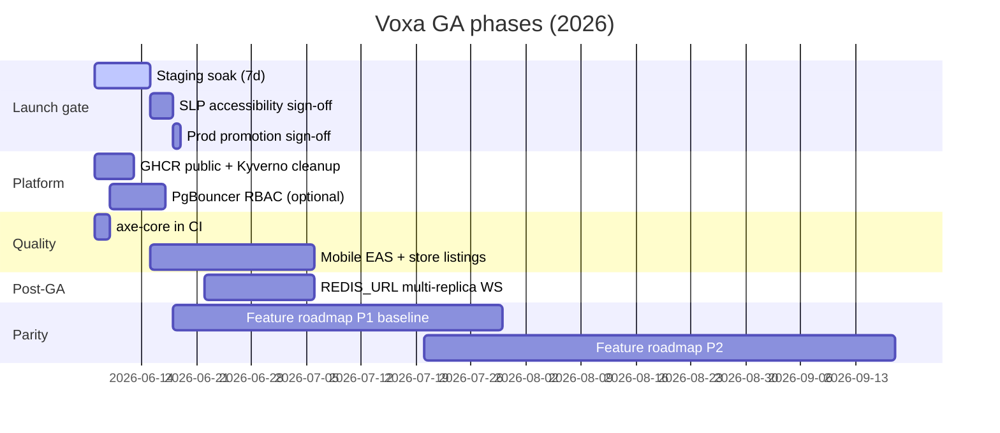

# Voxa commercial GA roadmap

Target: **full commercial general availability** for the Voxa AAC platform at [voxa.madfam.io](https://voxa.madfam.io).

Track checkbox progress in [GA_CHECKLIST.md](./GA_CHECKLIST.md).

> Public-safe roadmap. Live deploy state, platform identifiers, competitive research and parity scorecards live in MADFAM's private operations repository.

## Current state (2026-06-08)

| Area | Status |
|------|--------|
| Production + staging | Live, `authEnforced: true`, Postgres |
| Deploy automation | Enclii GitOps + GitHub webhook verified |
| Product (web) | Boards, Janua SSO, billing, AI MVP, legal, **commercial landing + demo** |
| Controlled launch | **Active** — prod commercial funnel live 2026-06-08 |
| Full commercial GA | **Soak gate** — declare **2026-06-15** ([GA_DECLARATION.md](./GA_DECLARATION.md)) |

## Phases


```mermaid
gantt
  title Voxa GA phases (2026)
  dateFormat YYYY-MM-DD
  section Launch gate
  Staging soak (7d)           :active, soak, 2026-06-08, 7d
  SLP accessibility sign-off  :slp, after soak, 3d
  Prod promotion sign-off     :promo, after slp, 1d
  section Platform
  GHCR public + Kyverno cleanup :ghcr, 2026-06-08, 5d
  PgBouncer RBAC (optional)     :pgb, 2026-06-10, 7d
  section Quality
  axe-core in CI                :axe, 2026-06-08, 2d
  Mobile EAS + store listings   :mobile, 2026-06-15, 21d
  section Post-GA
  REDIS_URL multi-replica WS    :redis, 2026-06-22, 14d
  section Parity
  Feature roadmap P1 baseline   :parity, 2026-06-18, 42d
  Feature roadmap P2           :parity2, 2026-07-20, 60d
```

### Phase 1 — Launch gate (product / clinical)

**Goal:** Confidence that staging behaves like production for AAC workflows before declaring GA.

| Work item | Owner | Target | Doc |
|-----------|-------|--------|-----|
| 7-day staging soak | Ops | 2026-06-08 → **2026-06-15** | [STAGING_SOAK.md](./STAGING_SOAK.md) |
| Daily automated health checks | CI + script | Daily during soak | `scripts/launch/soak-daily-check.sh` |
| Manual AAC scenarios (Janua, OBF, CVI, switch) | Product / QA | Once during soak | [STAGING_SOAK.md](./STAGING_SOAK.md) |
| SLP accessibility sign-off | Clinical | ✅ 2026-06-08 (owner-authorized) | [SLP_SIGNOFF.md](./SLP_SIGNOFF.md) |
| Merge `staging` → `main` | Engineering | After sign-off | Enclii deploy workflows |

**Exit criteria:** No S1/S2 on staging; Argo `voxa-staging-services` Synced/Healthy; SLP sign-off recorded; soak log complete.

### Phase 2 — Platform hygiene

**Goal:** Remove temporary infra exceptions; align with MADFAM platform standards.

| Work item | Owner | Target | Notes |
|-----------|-------|--------|-------|
| GHCR packages public (`voxa-api`, `voxa-web`) | Org admin | ✅ 2026-06-08 | Org-admin procedure (private) |
| Remove `k8s/*/signature-policyexception.yaml` | Engineering | ✅ 2026-06-08 | — |
| PgBouncer entries for the Voxa databases | Platform | Non-blocking | Direct Postgres OK today |
| Cluster CPU headroom | Platform | Ongoing | Prevents stalled platform rollouts |

### Phase 3 — Quality & accessibility automation

**Goal:** Prevent WCAG regressions on critical AAC flows in CI.

| Work item | Owner | Target | Notes |
|-----------|-------|--------|-------|
| `@axe-core/playwright` on home + legal pages | Engineering | 2026-06-08 | `e2e/specs/a11y.spec.ts`, CI job |
| Extend axe coverage to communicator + settings | Engineering | Post-GA | Editor mode, CVI themes |
| Playwright smoke (staging) | CI | Daily weekdays | `.github/workflows/e2e-smoke.yml` |

### Phase 4 — Mobile commercial path

**Goal:** Native iOS/Android store presence (parallel to web GA).

| Work item | Owner | Target | Doc |
|-----------|-------|--------|-----|
| EAS build profiles (preview + production) | Mobile | 2026-06-15 | [MOBILE_GA.md](./MOBILE_GA.md) |
| TestFlight / Play internal testing | Mobile | +1 week | |
| Store listings + privacy nutrition labels | Product / legal | Before public store GA | |
| Janua deep link + sync on device | Mobile | Before store GA | |

Web GA does **not** block on mobile store listings; mobile is tracked as **Phase 4**.

### Phase 5 — Post-GA scaling

| Work item | When | Notes |
|-----------|------|-------|
| `REDIS_URL` for WebSocket fan-out | After multi-replica API | Horizontal real-time sync |
| `SENTRY_DSN` in prod | When DSN provisioned | Hook already in API |
| Symbol generation / PictoBERT | Product roadmap | [ai-roadmap.md](../ai-roadmap.md) |

### Phase 6 — Feature roadmap

**Goal:** Close the remaining AAC feature gaps after web GA. The competitive research, parity tracker and scorecard behind this phase are private commercial material.

**Not a single-release gate:** web GA (M3) required the P0 rows and SLP sign-off; platform GA (M5) adds mobile store presence.

| Work stream | Priority | Target |
|-------------|----------|--------|
| Multi-board library + motor-plan locks in UI | P1 | Q3 2026 |
| ARASAAC / OpenSymbols integration | P1 | Q3 2026 |
| Recorded speech + GLP media upload | P1 | Q3 2026 |
| Hide/show + babble mode | P1 | Q3 2026 |
| Usage logs + SLP reporting UI | P1 | Q3 2026 |
| Grid/TouchChat/Snap import (AACProcessors) | P2 | Q4 2026 |
| Hardware switch + eye-gaze adapters | P2 | Q4 2026 |
| Neural bilingual TTS | P2 | Q4 2026 |
| PictoBERT + symbol generation GA | P3 | 2026 H2 |

## Milestones

| Milestone | Date (target) | Definition of done |
|-----------|---------------|-------------------|
| **M0 — Controlled launch** | 2026-06-07 | Prod live, auth enforced, legal pages, deploy hooks |
| **M1 — Webhook verified** | 2026-06-08 | GitHub → Enclii ping → 200 |
| **M2 — Soak complete** | 2026-06-15 | 7-day log green, manual scenarios checked |
| **M3 — Full web GA** | 2026-06-15 | Soak complete + [GA_DECLARATION.md](./GA_DECLARATION.md) signed |
| **M4 — Mobile beta** | 2026-07-06 | EAS builds in TestFlight / Play internal |
| **M5 — Full platform GA** | 2026-07-20 | Web + mobile store listings live |
| **M6 — Feature roadmap baseline** | 2026-09-30 | P1 feature rows shipped (tracked privately) |

## Verification commands

```bash
# Daily soak (staging health)
./scripts/launch/soak-daily-check.sh

# Production GA gate
./scripts/launch/verify-prod-ga.sh
```

Platform operator passes and org-admin steps run from MADFAM's private operations repository.

## Related docs

- [GA_CHECKLIST.md](./GA_CHECKLIST.md) — checkbox tracker
- [STAGING_SOAK.md](./STAGING_SOAK.md) — soak procedures and log
- [SLP_SIGNOFF.md](./SLP_SIGNOFF.md) — clinical accessibility gate
- [MOBILE_GA.md](./MOBILE_GA.md) — Expo / EAS store path
- [../accessibility.md](../accessibility.md) — WCAG 2.2 standards
- [../ai-roadmap.md](../ai-roadmap.md) — AI features post-GA
