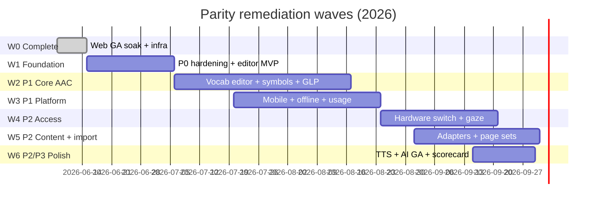

# Voxa benchmark feature parity — full remediation & implementation plan

**Purpose:** Close gaps vs Tier A and adjacent AAC platforms documented in [AAC_PLATFORM_BENCHMARK.md](./AAC_PLATFORM_BENCHMARK.md).  
**Tracker:** Row-level status in [FEATURE_PARITY.md](./FEATURE_PARITY.md).  
**Schedule:** Phases in [GA_ROADMAP.md](./GA_ROADMAP.md) (M3 → M6).  
**Last updated:** 2026-06-08

---

## 1. Executive summary

### 1.1 Question

> Have we achieved full feature parity against benchmarked direct and adjacent AAC platforms?

**No.** Voxa is at **~38% weighted capability coverage** vs the Tier A median (Proloquo2Go, TD Snap Core First, LAMP, Speak for Yourself, Grid 3). Full **benchmark parity** is defined as **≥ 75% weighted scorecard** and **≥ 80% of P1 rows at ✅ or 🟡** — target milestone **M6 (2026-09-30)**.

Web commercial GA (**M3, 2026-06-15**) intentionally does **not** require full parity; it requires **P0 complete**, clinical sign-off, and soak.

### 1.2 Strategic posture

| Axis | Incumbent strength | Voxa wedge | Parity implication |
|------|-------------------|------------|-------------------|
| Symbol count (PCS, SymbolStix) | Deep licensed libraries | ARASAAC + OpenSymbols + AI gen | Match **search + quality**, not 75k day-one |
| iOS-native access + hardware | Tobii, BT switches, keyguards | Web-first + mobile Phase 4 | **Mobile + hardware** are P1/P2 blockers for clinical default |
| Proprietary formats | `.gridset`, `.spb`, `.touchChat` | OBF-native + AACProcessors adapters | **Import pipelines** unlock migration marketing |
| Cloud teams | myTobiiDynavox, Grid cloud | Janua SSO + Postgres + Dhanam | **Real-time co-edit** needs Redis/WebSocket scale |
| AI | Static / n-gram | Consent-gated LLM + PictoBERT roadmap | **Differentiation** once baseline access/vocab solid |

### 1.3 Scorecard targets

| Milestone | Date | Weighted parity | P0 | P1 (✅+🟡) | Primary focus |
|-----------|------|-----------------|-----|------------|---------------|
| **Now** | 2026-06-08 | ~38% | Mostly ✅/🟡 | ~35% | Controlled web launch |
| **M3** Web GA | 2026-06-15 | ~52% | All ✅ | ~45% | Soak + declaration |
| **M4** Mobile beta | 2026-07-06 | ~58% | — | ~50% | EAS preview builds |
| **M5** Platform GA | 2026-07-20 | ~65% | — | ~65% | Store listings + offline |
| **M6** Tier A baseline | 2026-09-30 | **≥ 75%** | All ✅ | **≥ 80%** | P1 complete + P2 starters |

Recalculate after each epic using the method in [FEATURE_PARITY.md § Parity scorecard](./FEATURE_PARITY.md#parity-scorecard-approximate).

---

## 2. Remediation waves (implementation program)



| Wave | Dates | Goal | Exit criteria |
|------|-------|------|---------------|
| **W0** | Through 2026-06-15 | Web GA gate | [GA_DECLARATION.md](./GA_DECLARATION.md) signed; soak 7/7 |
| **W1** | 2026-06-15 → 2026-07-05 | Close remaining P0 🟡 | Offline retry reliable; editor PIN; axe on `/app` |
| **W2** | 2026-07-06 → 2026-08-16 | P1 vocabulary + symbols + GLP media | ARASAAC search; recorded speech; motor-plan UX |
| **W3** | 2026-07-20 → 2026-08-23 | P1 platform + clinical workflow | Mobile preview; usage logs UI; remote editor UX |
| **W4** | 2026-08-24 → 2026-09-20 | P2 access methods | BT/USB switch; Tobii adapter POC |
| **W5** | 2026-09-01 → 2026-09-30 | P2 interoperability + content | Grid/TouchChat/Snap import; starter core sets |
| **W6** | 2026-09-15 → 2026-09-30 | M6 sign-off | Scorecard ≥ 75%; SLP parity review |

---

## 3. Gap inventory → remediation map

Each epic links to [FEATURE_PARITY.md](./FEATURE_PARITY.md) rows and benchmark dimensions ([AAC_PLATFORM_BENCHMARK.md §4–5](./AAC_PLATFORM_BENCHMARK.md)).

### Epic A — P0 hardening (W1)

**Problem:** Remaining 🟡 P0 items undermine “robust AAC” claims and SLP confidence.

| ID | Feature | Current | Remediation | Implementation |
|----|---------|---------|-------------|----------------|
| A1 | Switch scanning | 🟡 web only | Voice cue + pause on speak; USB switch keys (Space/Tab/F13) ✅ 2026-06-09 |
| A2 | Eye dwell | 🟡 pointer sim | Configurable dwell; touch-release vs touch-start; snap-to-cell | `@voxa/access` `EyeTrackingConfig`, touch activation setting ✅ 2026-06-09 (partial) |
| A3 | SLP editor | 🟡 basic | Editor PIN lock; grid resize validation; slot lock enforcement in UI | `board-screen.tsx` `EditorPanel`, `@voxa/core` `locked` |
| A4 | Offline cache | 🟡 IndexedDB pending | Sync banner + local OBF export fallback + offline e2e (2026-06-09) |
| A5 | A11y CI scope | ✅ legal/home | Extend axe to `/app`, `/demo`, editor, settings | `e2e/specs/a11y.spec.ts` |
| A6 | Soak / clinical | ✅ SLP 2026-06-08 | Extend SLP sign-off template for mobile when M4 ready | [SLP_SIGNOFF.md](./SLP_SIGNOFF.md) |

**Acceptance (W1):**

- [x] User can complete board edit → speak → OBF export offline-then-online without data loss (2026-06-09)
- [x] Editor changes respect `locked` buttons (communicator cannot drag locked cells) (2026-06-09)
- [x] axe CI covers communicator, demo, settings dialog, and editor mode (2026-06-09)
- [x] Switch scan e2e on staging passes with auditory prompt toggle (2026-06-09)

**Tests:** `e2e/specs/staging-ux.spec.ts`, new `offline-sync.spec.ts`, `@voxa/sync` unit tests.

---

### Epic B — Vocabulary & editor (W2) — P1

**Benchmark gap:** Multi-board libraries, motor planning, hide/show, Fitzgerald coverage, custom grid — table stakes for Proloquo / SFY / LAMP comparisons.

| ID | Feature | Remediation | Implementation |
|----|---------|-------------|----------------|
| B1 | Multi-board library | Board list UX; rename/duplicate/delete; default board per profile | Picker + create/rename/duplicate/delete ✅ 2026-06-09 |
| B2 | Motor-plan locks | Visual lock indicator; prevent move/delete of locked slots; SLP override | Drag-drop grid editor + `moveButtonToCell` guards ✅ 2026-06-09 |
| B3 | Hide/show + babble | Toggle `hidden`; “show all” babble mode (communicator) | `hidden` in editor + **Babble** session toggle ✅ 2026-06-08 |
| B4 | Custom grid 9–144+ | Editor rows/cols with validation; reflow rules | `resizeBoardGrid` + editor **Grid** panel ✅ 2026-06-09 |
| B5 | Symbol/label modes | ✅ partial | Unify `hideLabels`/`hideSymbols` per board + profile | `Board.display` + `effectiveDisplaySettings` ✅ 2026-06-09 |
| B6 | Fitzgerald POS | ✅ colors | Apply POS colors on **all** buttons including imports | `resolvePartOfSpeech` + OBF `border_color` ✅ 2026-06-09 |
| B7 | Word forms / inflection | Morphology table for top 200 core verbs/nouns | `speechForms` + `suggestInflections` + editor panel ✅ 2026-06-09 |
| B8 | Whisper mode | Message bar “hold to preview” without speak | **Whisper mode** setting — build utterance without TTS ✅ 2026-06-08 |
| B9 | Links to other boards | OBF `links` → navigate to linked board | OBF `load_board_id` ↔ `navigateToBoardId`; editor + activate ✅ 2026-06-08 |

**Acceptance (W2):**

- [x] SLP creates 3 boards, switches between them, exports each as OBF (2026-06-09)
- [x] Locked core words stay fixed after fringe edits (2026-06-09)
- [x] Babble reveals hidden buttons for one session then resets (2026-06-09)

**Tests:** API integration tests for boards CRUD; Playwright editor scenarios.

---

### Epic C — Symbols & media (W2) — P1

**Benchmark gap:** Tier A ships large symbol sets + recorded speech; Voxa has demo symbols only.

| ID | Feature | Remediation | Implementation |
|----|---------|-------------|----------------|
| C1 | ARASAAC / OpenSymbols | Symbol search API; attach `symbolUrl` to analytic buttons | New `packages/symbols` or API route `/v1/symbols/search`; cache CDN |
| C2 | Custom photo upload | S3-compatible object store; signed upload URL | API `POST /v1/media` image types + editor upload ✅ 2026-06-09 |
| C3 | Recorded speech | Record/upload audio per button; play instead of TTS when set | `@voxa/core` `RecordedSpeech`; API `POST/GET /v1/media`; web `MediaRecorder` ✅ 2026-06-08 |
| C4 | GLP video/audio | GLP buttons store `mediaUrl` + intonation notes | GLP video upload + playback ✅ 2026-06-08 |
| C5 | `.obz` bundles | Import/export ZIP with images | `@voxa/obf` pack/unpack + API + editor ✅ 2026-06-08 |

**Acceptance (W2):**

- [x] Editor search “eat” → pick ARASAAC symbol → saved on button (2026-06-09)
- [x] GLP button plays caregiver recording in communicator (2026-06-09)
- [x] OBZ round-trip preserves images (2026-06-09)

**Dependencies:** Object storage (Enclii addon or S3); media size limits in [DATA_HANDLING.md](../legal/DATA_HANDLING.md).

---

### Epic D — Platform & distribution (W3) — P1

**Benchmark gap:** All Tier A apps have native iOS; most lack web. Voxa must **not** lose mobile.

| ID | Feature | Remediation | Implementation |
|----|---------|-------------|----------------|
| D1 | iOS + Android apps | EAS preview → production | [MOBILE_GA.md](./MOBILE_GA.md), `app.config.js` env + icons + CI guard ✅ 2026-06-09 |
| D2 | Janua mobile OAuth | Universal links / app links | `expo-auth-session` + SecureStore + token refresh ✅ 2026-06-09 |
| D3 | Offline on device | SQLite/AsyncStorage + sync queue | AsyncStorage cache, NetInfo flush, retry UI ✅ 2026-06-09 |
| D4 | PWA install | Web manifest + install prompt on landing | `manifest.webmanifest` + install banner ✅ 2026-06-09 |
| D5 | Windows | Edge/Chrome PWA + optional Electron wrapper | Post-M5 optional |

**Acceptance (M5):**

- [ ] TestFlight + Play internal builds use prod API
- [ ] Same account boards appear on web and mobile within 60s

---

### Epic E — Cloud, teams & clinical (W3) — P1

**Benchmark gap:** TD Snap / Grid lead on usage analytics and remote edit.

| ID | Feature | Remediation | Implementation |
|----|---------|-------------|----------------|
| E1 | Usage / activation log | Append-only events; consent gate | API `POST /v1/events`, Postgres `activations`; `@voxa/core` event schema |
| E2 | SLP reporting UI | Aggregate charts (no PII by default) | Web **Usage** panel in `/app` for editors (2026-06-08); `/app/reports` institutional tier later |
| E3 | Remote SLP edit | Role `editor` vs `communicator`; audit log | `/app/edit`, org-scoped access, audit API + panel ✅ 2026-06-09 |
| E4 | Real-time co-edit | Multi-user board sync | Redis pub/sub fan-out when `REDIS_URL` set ✅ 2026-06-09; WS auth P2 |
| E5 | Share vocabulary sets | Export board pack to org library | Org-scoped board templates API |

**Acceptance (W3):**

- [x] With consent, SLP sees weekly activation counts per board (2026-06-09)
- [x] Two editors see live cursor/lock (or last-write-wins v1) — 409 refetch + WS peer refresh (2026-06-09)

**Infra:** Provision Redis ([GA_STATUS](../launch/GA_STATUS.md) P2); scale API replicas.

---

### Epic F — Access hardware (W4) — P2

**Benchmark gap:** TD Snap Scanning, Grid eye gaze — primary differentiators for complex access needs.

| ID | Feature | Remediation | Implementation |
|----|---------|-------------|----------------|
| F1 | Bluetooth/USB switch | iOS `ExternalAccessory` / Android HID; web Gamepad API | `packages/access` `HardwareSwitchAdapter`; mobile native module |
| F2 | Auditory scanning | Beep on scan step; voice prompt option | `@voxa/access` audio cues |
| F3 | Group / region scan | Scan by row groups, regions | Extend `SwitchScanConfig` |
| F4 | Tobii / IrisBond gaze | SDK integration (Windows/iOS first) | Adapter service; dwell from gaze coords |
| F5 | Keyguard / touch guard | Screen regions masked | Configurable mask overlay |
| F6 | Touch-release vs touch-start | Setting for motor profile | `@voxa/access` |

**Acceptance (W4):**

- [ ] Reference BT switch advances scan on iOS TestFlight build
- [ ] Tobii POC: dwell select on Windows browser (lab device)

**Clinical:** Document supported hardware matrix in [accessibility.md](../accessibility.md).

---

### Epic G — Interoperability & migration (W5) — P2

**Benchmark gap:** Competitors lock users in; Voxa wins on OBF — must add **legacy import**.

| ID | Feature | Remediation | Implementation |
|----|---------|-------------|----------------|
| G1 | `.gridset` import | AACProcessors pipeline → OBF → Voxa | `packages/import-adapters` CLI + API job |
| G2 | TouchChat import | Same pipeline | [MIGRATION.md](./MIGRATION.md) |
| G3 | Snap `.spb` import | Same pipeline | |
| G4 | Cboard / OBF direct | ✅ | Maintain compatibility tests |
| G5 | Proloquo manual path | ARASAAC rebuild guide | Docs + wizard “map symbols” |
| G6 | LAMP / SFY motor map | Consultant-led mapping project | Professional services doc, not automated v1 |

**Acceptance (W5):**

- [ ] Sample Grid gridset imports with ≥ 90% button preservation
- [ ] Import job status UI in web editor

**Reference:** [willwade/AACProcessors](https://github.com/willwade/AACProcessors).

---

### Epic H — Content & linguistics (W5) — P2

**Benchmark gap:** Crescendo, Core First, PODD page sets.

| ID | Feature | Remediation | Implementation |
|----|---------|-------------|----------------|
| H1 | Core word page sets | Ship “Voxa Core 47” + “Core 100” OBF templates | `packages/core` starter boards, download in app |
| H2 | PODD / Gateway | Partner content or licensed sets | Legal review; optional IAP |
| H3 | Visual schedules | Timeline board type or linked schedule view | New board `kind: schedule` or integration |
| H4 | Literacy / keyboard | Text keyboard page for literate users | Text buttons + prediction strip |
| H5 | Diversity / skin tone | ARASAAC variant picker | Symbol metadata |

---

### Epic I — Speech & AI (W6) — P2/P3

| ID | Feature | Remediation | Implementation |
|----|---------|-------------|----------------|
| I1 | Neural TTS | Cloud voices (Azure/Google/Eleven per vendor) | API `/v1/tts`, replace Web Speech where configured |
| I2 | Bilingual mid-sentence | Language tag per word | [ai-roadmap.md](../ai-roadmap.md) |
| I3 | PictoBERT strip | Production model + top-3 symbols | `@voxa/ai`, `prediction-strip.tsx` |
| I4 | LLM prediction GA | Tune prompts; SLP blocklist | Existing AI routes + consent |
| I5 | Symbol generation | Guardrailed image gen | `@voxa/ai` + moderation |
| I6 | On-device AI v2 | Small model for offline predict | Post-M6 research |

**Acceptance (W6):**

- [ ] User toggles en-US / es-MX voices in one utterance
- [ ] PictoBERT strip improves path length in lab study (internal metric)

---

## 4. Package & service ownership

| Package / app | Parity epics | Notes |
|---------------|--------------|-------|
| `@voxa/core` | B, C, H | Board model, GLP, locks, hidden |
| `@voxa/access` | A, F | Scan, dwell, hardware adapters |
| `@voxa/ui` | A, B | Grid, buttons, themes |
| `@voxa/obf` | B, C, G | OBF/OBZ, links |
| `@voxa/sync` | A, D, E | Offline queue, WebSocket |
| `@voxa/vocabulary` | B, H | Inflection, page sets |
| `@voxa/symbols` (new) | C | ARASAAC client |
| `@voxa/import-adapters` (new) | G | AACProcessors wrappers |
| `@voxa/ai` | I | LLM, PictoBERT, gen |
| `apps/web` | All | Primary delivery surface |
| `apps/mobile` | D, F, C | Native access + media |
| `apps/api` | C, E, G, I | Media, events, import jobs, TTS |
| `e2e/` | All | Playwright parity regression |

---

## 5. Verification & scorecard discipline

### 5.1 Per-epic gates

Each epic PR must include:

1. **FEATURE_PARITY.md** row updates (status + notes)
2. **Automated tests** (unit and/or e2e) cited in PR template
3. **Accessibility** — no new axe violations on touched routes
4. **Migration doc** update if import/export behavior changes

### 5.2 Milestone scorecard review

| When | Action | Owner |
|------|--------|-------|
| Epic merge | Update affected rows in FEATURE_PARITY.md | Engineering |
| Bi-weekly | Recalculate weighted scorecard | Product |
| M6 (2026-09-30) | SLP parity review vs P1 checklist | Clinical |
| Quarterly | Refresh AAC_PLATFORM_BENCHMARK.md pricing/features | Product |

### 5.3 Parity verification commands

```bash
# Scorecard gate (fails until 7 soak days complete — separate from parity)
./scripts/launch/verify-soak-window.sh --required 7 --start 2026-06-08

# GHCR / deploy hygiene
./scripts/deploy/make-ghcr-packages-public.sh --check

# Full staging parity smoke (extend over time)
./scripts/launch/soak-scenarios.sh --with-auth
pnpm test:e2e:a11y
pnpm test:e2e:staging

# Unit + types
pnpm test && pnpm typecheck
```

### 5.4 Planned e2e expansion (parity CI)

| Spec | Covers | Epic |
|------|--------|------|
| `a11y.spec.ts` | `/`, `/demo`, `/app`, editor | A5 |
| `editor-parity.spec.ts` (new) | Lock, hide, grid resize, OBF | B |
| `symbols.spec.ts` (new) | ARASAAC attach | C |
| `mobile-smoke.spec.ts` (new) | Detox / Maestro on EAS build | D |
| `import-grid.spec.ts` (new) | Sample gridset | G |

---

## 6. Dependencies & infra

| Dependency | Blocks | Mitigation | Target |
|------------|--------|------------|--------|
| Object storage for media | C2–C4 | Enclii S3 addon or R2 | W2 |
| `REDIS_URL` | E4 real-time | Phase 5 GA_ROADMAP | W3 |
| Expo / store accounts | D1 | MOBILE_GA checklist | M4 |
| Tobii SDK license | F4 | Lab partnership | W4 |
| ARASAAC API terms | C1 | Cache + attribution page | W2 |
| AACProcessors maintenance | G1–G3 | Vendor fork if needed | W5 |

---

## 7. Risk register (parity program)

| Risk | Impact | Mitigation |
|------|--------|------------|
| Scope creep to 100% PCS parity | Miss M6 | Target **75% weighted**, not clone |
| Mobile delays block M5 | “Not real AAC” narrative | PWA + web GA; parallel mobile |
| Import fidelity < 90% | Bad migrations | Human QA gridsets; preview diff UI |
| AI safety incident | Trust loss | Consent, moderation, no auto-speak |
| Hardware lab unavailable | F4 slips | Ship BT switch first; gaze beta |
| SLP reviewer bandwidth | M6 slip | Owner-authorized process + async checklist |

---

## 8. Documentation matrix

| Document | Role in parity program | Update trigger |
|----------|------------------------|----------------|
| **This doc** | Master remediation + implementation plan | Each wave start/end |
| [FEATURE_PARITY.md](./FEATURE_PARITY.md) | Row-level status & scorecard | Every epic |
| [AAC_PLATFORM_BENCHMARK.md](./AAC_PLATFORM_BENCHMARK.md) | Competitive research source | Quarterly |
| [GA_ROADMAP.md](./GA_ROADMAP.md) | Milestones M3–M6 | Milestone shift |
| [MIGRATION.md](./MIGRATION.md) | User-facing import guides | Epic G |
| [MOBILE_GA.md](./MOBILE_GA.md) | Native delivery | Epic D |
| [ai-roadmap.md](../ai-roadmap.md) | AI epics I3–I6 | Epic I |
| [linguistic-framework.md](../linguistic-framework.md) | GLP / motor plan theory | Epic B, H |
| [SLP_SIGNOFF.md](./SLP_SIGNOFF.md) | Clinical gates | M3, M6 |
| [accessibility.md](../accessibility.md) | WCAG + hardware matrix | Epic A, F |

---

## 9. Definition of done — full benchmark parity (M6)

**Full benchmark feature parity** is declared when **all** of the following hold:

1. **Weighted scorecard ≥ 75%** vs Tier A median ([FEATURE_PARITY.md](./FEATURE_PARITY.md))
2. **P0:** 100% ✅
3. **P1:** ≥ 80% of rows ✅ or 🟡 (no 🔴 on mobile, recorded speech, symbol search, usage logs)
4. **P2:** ≥ 50% of rows ✅ or 🟡 (import adapters + hardware switch minimum)
5. **P3 differentiation:** LLM + OBF + WCAG CI remain ✅
6. **Clinical:** SLP parity sign-off recorded (extend [SLP_SIGNOFF.md](./SLP_SIGNOFF.md))
7. **CI:** Parity e2e suite green on staging for two consecutive weekly runs
8. **Docs:** AAC_PLATFORM_BENCHMARK refreshed; marketing claims audited against matrix

**Not required for M6:** Apple Watch, Google Assistant, PODD licensed content, 75k PCS library, head tracking.

---

## 10. Immediate next actions (post–web GA soak)

| Priority | Action | Wave | Owner |
|----------|--------|------|-------|
| 1 | Complete 7-day soak; sign GA declaration | W0 | Ops |
| 2 | Extend axe to `/app` + `/demo` | A5 | Engineering ✅ 2026-06-08 |
| 3 | Editor PIN + lock enforcement UX | A3, B2 | Engineering ✅ 2026-06-08 |
| 4 | Offline write queue hardening | A4 | Engineering ✅ 2026-06-08 |
| 5 | Kickoff `@voxa/symbols` ARASAAC spike | C1 | Engineering ✅ 2026-06-08 |
| 6 | EAS preview build on staging API | D1 | Mobile ✅ 2026-06-08 |
| 7 | Usage event schema + API | E1 | Engineering ✅ 2026-06-08 |
| 8 | SLP usage summary UI in `/app` | E2 | Engineering ✅ 2026-06-08 |
| 9 | Recorded speech + GLP media (C3/C4) | C | Engineering ✅ 2026-06-08 |
| 10 | OBF board navigation (B9) | B | Engineering ✅ 2026-06-08 |
| 11 | EAS preview CI workflow (D1) | D | Mobile ✅ 2026-06-08 |
| 12 | Babble + whisper communicator modes (B3/B8) | B | Engineering ✅ 2026-06-08 |
| 13 | OBZ import/export with images (C5) | C | Engineering ✅ 2026-06-08 |
| 14 | Custom grid editor + reflow (B4) | B | Engineering ✅ 2026-06-09 |
| 15 | Board rename/duplicate/delete (B1) | B | Engineering ✅ 2026-06-09 |
| 16 | Word forms / inflection (B7) | B | Engineering ✅ 2026-06-09 |
| 17 | Editor drag-move with motor-plan guards (B2) | B | Engineering ✅ 2026-06-09 |
| 18 | Fitzgerald POS on imports + display (B6) | B | Engineering ✅ 2026-06-09 |
| 19 | Board + profile symbol/label modes (B5) | B | Engineering ✅ 2026-06-09 |
| 20 | Custom photo symbol upload (C2) | C | Engineering ✅ 2026-06-09 |
| 21 | Switch scan voice + pause while speaking (A1) | A | Engineering ✅ 2026-06-09 |
| 22 | Touch-release activation setting (A2) | A | Engineering ✅ 2026-06-09 |
| 23 | Remote SLP editor + audit log (E3) | E | Engineering ✅ 2026-06-09 |
| 24 | Mobile Janua OAuth + offline sync (D2/D3) | D | Mobile ✅ 2026-06-09 |
| 25 | PWA manifest + install prompt (D4) | D | Engineering ✅ 2026-06-09 |
| 26 | Mobile EAS env wiring + icons + CI guard (D1) | D | Mobile ✅ 2026-06-09 |
| 27 | Redis-backed WebSocket sync fan-out (E4) | E | Engineering ✅ 2026-06-09 |
| 28 | WS auth + client self-event filter + declaration-day script (E4/W0) | E/W0 | Engineering ✅ 2026-06-09 |
| 29 | Save conflict refetch UX + mobile OAuth refresh (A4/D2) | A/D | Engineering ✅ 2026-06-09 |
| 30 | Sync status banner + USB switch keys + save conflict toast (A4/A1) | A | Engineering ✅ 2026-06-09 |
| 31 | Soak progress CI + mobile switch scan mode (W0/A1) | W0/A | Engineering ✅ 2026-06-09 |
| 32 | Axe on /app settings + editor; switch scan staging e2e (A5/A1) | A | Engineering ✅ 2026-06-09 |
| 33 | Offline save queue tests + locked-slot drag guard e2e (A4/A3) | A | Engineering ✅ 2026-06-09 |
| 34 | Offline OBF export fallback + edit/speak/sync e2e (A4/W1) | A | Engineering ✅ 2026-06-09 |
| 35 | Editor workflow e2e: 3-board OBF, locked core, babble reset (B/W2) | B | Engineering ✅ 2026-06-09 |
| 36 | Media workflow e2e: ARASAAC, GLP audio, OBZ images (C/W2) | C | Engineering ✅ 2026-06-09 |
| 37 | Clinical workflow e2e: usage report, remote edit, audit (E/W3) | E | Engineering ✅ 2026-06-09 |
| 38 | EAS config guard + mobile settings tests (D1/W3) | D | Mobile ✅ 2026-06-09 |
| 39 | Soak status + prod Redis verify + mobile scan tune (W0/E4/D) | W0/E4/D | Ops/Engineering ✅ 2026-06-09 |
| 40 | Fix soak-status pass-day detection (W0) | W0 | Engineering ✅ 2026-06-09 |
| 41 | TestFlight bootstrap + submit CI + mobile BT switch keys (D1/F1) | D/F | Mobile ✅ 2026-06-09 |

---

## Related

- [FEATURE_PARITY.md](./FEATURE_PARITY.md) — status tracker  
- [AAC_PLATFORM_BENCHMARK.md](./AAC_PLATFORM_BENCHMARK.md) — competitor research  
- [GA_ROADMAP.md](./GA_ROADMAP.md) — release milestones  
- [REMEDIATION_PLAN.md](./REMEDIATION_PLAN.md) — web GA remediation (W0–W1)  
- [PRD.md](../../PRD.md) — product requirements  
