# Voxa pricing strategy (Tulana-anchored)

**Status:** v0.1 shipped to Dhanam catalog + landing (2026-06-12) — **low confidence** until Tulana COGS entry + Phynd WTP  
**Last updated:** 2026-06-12  
**Inputs:** [AAC_PLATFORM_BENCHMARK.md](./AAC_PLATFORM_BENCHMARK.md), Tulana methodology, MADFAM ecosystem anchors ([2026-04-25-tulana-ecosystem-pricing.md](../../../internal-devops/decisions/2026-04-25-tulana-ecosystem-pricing.md))

---

## 1. Executive summary

Voxa monetizes on three tiers already wired in `@voxa/api` (`free` | `family` | `clinic`). Tulana has **no Voxa SKUs yet** — this dossier is the handoff package to register products in Dhanam, import benchmark universes, and reach medium-confidence prices before paid checkout goes live.

| Tier | Audience | Tulana SKU (proposed) | Recommended MXN | Confidence |
|------|----------|----------------------|-----------------|------------|
| **Parent** | Individual caregiver | `voxa__free` | **$0** | High (strategic) |
| **Family** | Home + small care team | `voxa__family` | **199/mo** or **1,899/yr** | Low |
| **Institutional** | Clinics, schools, districts | `voxa__clinic` | **1,499/mo base + 349/seat** (min 3) | Low |

**Positioning:** Price **at or below** global AAC subscription leaders (~170 MXN/mo App Store) on an **annual** basis, while **monthly** aligns with MADFAM consumer SaaS (Tezca Essentials 199, Dhanam Copilot 199). Institutional pricing sits **below** custom Grid/Tobii enterprise quotes but **above** per-user consumer subs because of reports, SSO, and full AI.

---

## 2. Why Tulana (and current gap)

```mermaid
flowchart LR
  A[AAC benchmark doc] --> B[Dhanam catalog SKUs]
  B --> C[tulana_pull_catalog]
  C --> D[Import benchmark-universe.json]
  D --> E[Seed competitor observations]
  E --> F[Enter COGS]
  F --> G[tulana_recommend]
  G --> H[Phynd Van Westendorp]
  H --> I[Selva approve dossier]
  I --> J[Dhanam apply prices]
  J --> K[Voxa landing + checkout]
```



| Step | Artifact | State |
|------|----------|-------|
| Product benchmark | `docs/launch/AAC_PLATFORM_BENCHMARK.md` | ✅ Done |
| Tulana competitor seed | `docs/launch/tulana/competitor-prices-seed.csv` | ✅ Draft |
| Tulana universe import | `docs/launch/tulana/benchmark-universe.json` | ✅ Draft (`dry_run: true`) |
| COGS for floor | `docs/launch/tulana/cogs-assumptions.md` | ✅ Draft |
| Dhanam catalog | `dhanam/catalog.yaml` + `tulana/dhanam-catalog-proposal.yaml` | ✅ Registered 2026-06-12 |
| Tulana mirror | `tulana/data/benchmark-universes/voxa.json` | ✅ Import pending prod pull |
| WTP campaign | PhyndCRM | ❌ Not run |

---

## 3. Tier model (product ↔ billing)

Matches `apps/api/src/lib/dhanam.ts`:

| Tier | Entitlements | Commercial intent |
|------|--------------|-------------------|
| `free` | 1 board, sync, OBF, `ai:basic` | Acquisition; parents always free (landing promise) |
| `family` | 10 boards, team:3, `ai:basic` | Paid home / extended family |
| `clinic` | Unlimited boards, team unlimited, `ai:full`, reports | B2B2C: SLPs, schools, IMSS-adjacent NGOs |

Display names on [landing-page.tsx](../../apps/web/src/components/landing-page.tsx): Free / Family / Institutional → map to Dhanam tiers above.

---

## 4. Competitor normalization (2026-06)

App Store AAC moved to **~$9.99/mo** subscriptions (Proloquo, TD Snap speaking). Older benchmark text citing “~$50/mo class” reflects **bundled clinical / legacy** pricing, not the current consumer floor.

### Subscription-native comparables (Family SKU)

| Comparator | Normalized USD/mo | MXN/mo @17 | Unit |
|------------|-------------------|------------|------|
| Proloquo + Coach | 9.99 | 170 | flat_monthly |
| TD Snap speaking | 9.99 | 170 | flat_monthly |
| TD Snap + PODD | 14.98 | 255 | flat_monthly |
| Avaz premium (indic.) | 14.99 | 255 | flat_monthly |
| Flexspeak (indic.) | 12.99 | 221 | flat_monthly |

**Median (subscription rows):** ~**221 MXN/mo**  
**Tulana ceiling (0.8 × median):** ~**177 MXN/mo**

### Adjacent (one-time / free)

| Comparator | Normalized USD/mo | Notes |
|------------|-------------------|-------|
| Proloquo2Go (60mo amort.) | 4.17 | Legacy SLP default |
| Cboard hosted | 0 | Open-source pressure |
| GoTalk NOW Plus (est.) | 5.00 | Tier B |

Full capture sheet: [competitor-prices-seed.csv](./tulana/competitor-prices-seed.csv).

---

## 5. Tulana floor / ceiling math

**Methodology** ([launch-sku-methodology.md](../../../tulana/docs/launch-sku-methodology.md)):

- **Floor** = 1.1 × monthly COGS (MXN)
- **Ceiling** = 0.8 × median(competitor MXN/mo)
- **Recommended** = WTP optimal clipped to [floor, ceiling], rounded to ergonomic MXN (199, 499, 1,499…)

### Family (`voxa__family`)

| Signal | MXN/mo |
|--------|--------|
| COGS (est.) | 61 |
| Floor (×1.1) | **67** |
| Competitor ceiling | **177** |
| Mechanical Tulana band | 67 – 177 |
| MADFAM peer anchor (Tezca Essentials) | **199** |
| **Recommended monthly** | **199** |
| **Recommended annual** | **1,899** (~158/mo; under Proloquo $99.99/yr) |

**Rationale for 199 vs 177 ceiling:** Same pattern as Karafiel (value above mechanical ceiling): hosted web + sync + OBF + team editors + bilingual stack is worth a **MADFAM consumer SaaS** anchor, not bare App Store parity. Annual plan satisfies subscription-sensitive buyers and NDIS/plan-manager workflows that reject pure monthly app billing.

### Institutional (`voxa__clinic`)

| Signal | MXN |
|--------|-----|
| COGS per seat (est.) | 122 |
| Floor per seat (×1.1) | **134** |
| Consumer sub ceiling (proxy) | 177 |
| Dhanam Teams peer | **1,499/mo** flat B2B |
| **Recommended** | **1,499/mo org** + **349/seat/mo** (min 3 seats) |

Alternative quote-friendly packaging: **999/seat/mo** all-in for ≤10 seats (no separate base) — use in Phynd WTP A/B.

---

## 6. Recommended price card (pre-WTP)

Prices **exclude 16% IVA** in internal planning; display on madfam.io with IVA per Dhanam convention.

| Plan | Monthly MXN | Annual MXN | IVA-inclusive display (×1.16) |
|------|-------------|------------|----------------------------------|
| Parent | 0 | 0 | Gratis |
| Family | 199 | 1,899 | ~231 / ~2,203 |
| Clinic (3 seats) | 1,499 + 3×349 = **2,546** | Custom −10% | Sales-assisted |

**Promotions (align with Tezca):**

- 14-day trial on Family (no card) or 30-day with card
- Launch: first 3 months at **149/mo** Family (Phynd promo code)

**Mexico-specific:**

- Offer **factura CFDI** via Dhanam for clinics (required for many institutions)
- Document **donation / grant** path for parent free tier (no change to $0)

---

## 7. Operator runbook (Tulana)

Run from `tulana/apps/api` on Enclii builder or local venv with Dhanam sync configured.

```bash
# 1. Register Voxa in Dhanam catalog (see dhanam-catalog-proposal.yaml), then:
python manage.py tulana_pull_catalog

# 2. Validate benchmark import (starts dry_run in repo copy)
python manage.py tulana_import_benchmark_universes \
  --file /path/to/voxa/docs/launch/tulana/benchmark-universe.json \
  --dry-run

# 3. After legal marks sources allowed, import for real (set dry_run false in JSON)
python manage.py tulana_import_benchmark_universes \
  --file /path/to/voxa/docs/launch/tulana/benchmark-universe.json

# 4. Enter COGS from cogs-assumptions.md in admin UI

# 5. Recommend
python manage.py tulana_recommend --sku voxa__family
python manage.py tulana_recommend --sku voxa__clinic

# 6. Capture queue
python manage.py tulana_capture_targets --status ready_for_capture --json
```

Seed competitor observations from CSV via Tulana admin or future `tulana_seed_competitors` extension for AAC segment.

---

## 8. WTP survey (PhyndCRM)

Target **≥10 responses per paid SKU** ([Van Westendorp four questions](../../../tulana/docs/launch-sku-methodology.md)):

| Segment | Channel | SKU |
|---------|---------|-----|
| Parents / caregivers | Voxa waitlist, demo exit survey | `voxa__family` |
| SLPs / clinic admins | Phynd healthcare tags, CONAMECE-adjacent lists | `voxa__clinic` |

Survey copy should name deliverables: “10 boards, 3 editors, cloud sync, OBF, basic AI” vs “unlimited boards, usage reports, full AI, SSO”.

**Gate:** Do not enable Stripe/Dhanam checkout until WTP optimal sits within ±15% of recommended prices or Selva explicitly waives (Karafiel precedent).

---

## 9. Product implementation checklist

| Item | Owner | Notes |
|------|-------|-------|
| Add `voxa` to `dhanam/catalog.yaml` | Platform | ✅ Done 2026-06-12 — run `sync-catalog.ts` on Enclii |
| Stripe price IDs | Dhanam | MXN monthly + annual Family |
| `apps/web` pricing display | Voxa | ✅ `apps/web/src/lib/pricing.ts` + landing i18n |
| Entitlement mapping | Voxa API | Already `free`/`family`/`clinic` |
| GA commercial gate | Launch | Paid checkout optional for web GA; free tier sufficient for soak |

---

## 10. Risks

| Risk | Mitigation |
|------|------------|
| App Store AAC at $9.99 USD feels cheaper | Lead with **web + Android path**, annual plan, team sync |
| Cboard free | Keep generous free tier; monetize team + boards + AI |
| Low Tulana confidence | Run WTP before marketing concrete MXN on landing |
| Symbol library gap | Institutional sales-led until PCS/ARASAAC parity |

---

## Related

- [AAC_PLATFORM_BENCHMARK.md](./AAC_PLATFORM_BENCHMARK.md) — feature + market structure
- [tulana/benchmark-universe.json](./tulana/benchmark-universe.json) — import payload
- [tulana/cogs-assumptions.md](./tulana/cogs-assumptions.md) — floor inputs
- [tulana/competitor-prices-seed.csv](./tulana/competitor-prices-seed.csv) — observation seed
- [tulana/dhanam-catalog-proposal.yaml](./tulana/dhanam-catalog-proposal.yaml) — Dhanam registration draft
